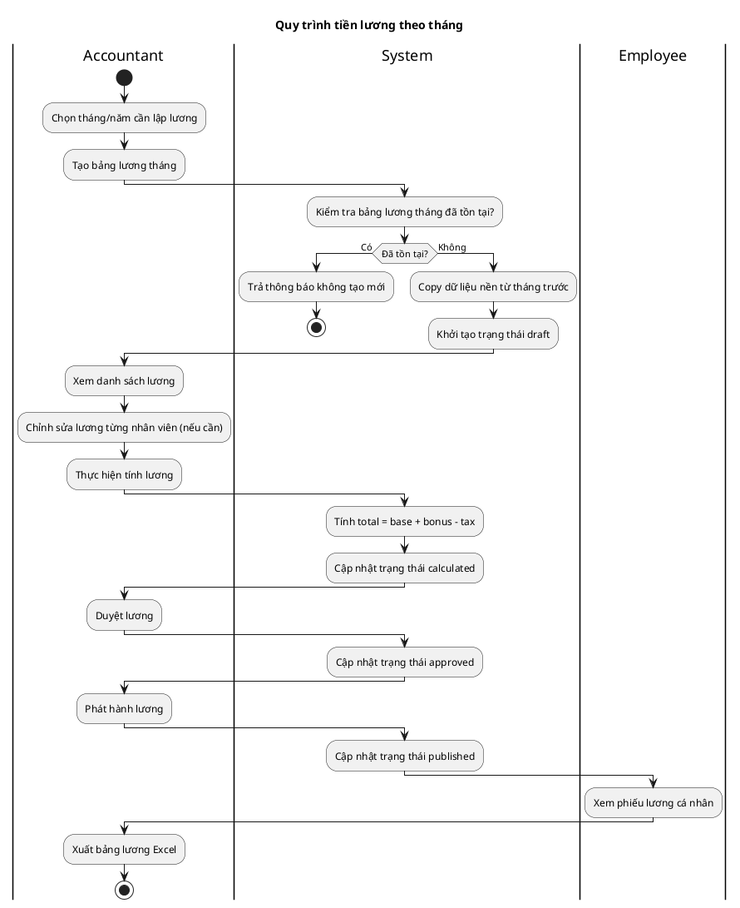
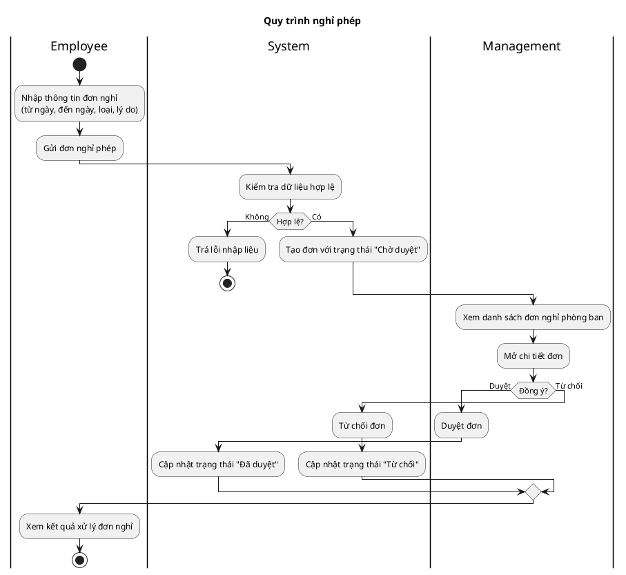
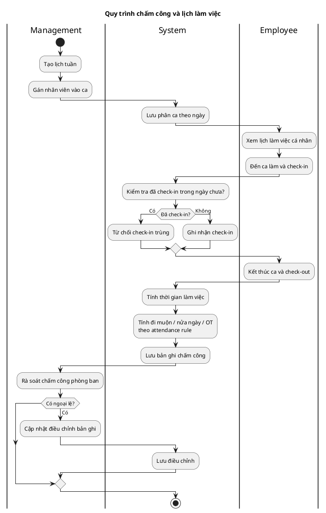
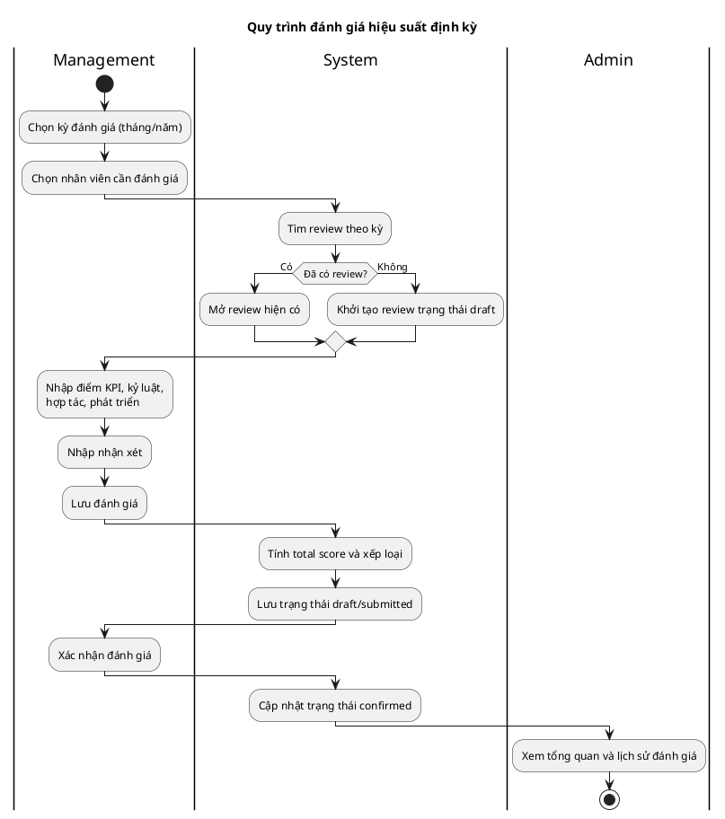

# Quy trình nghiệp vụ trọng tâm - Activity Diagram (PlantUML)

Tài liệu này gồm 4 quy trình nghiệp vụ quan trọng của hệ thống StaffHub. Mỗi mục có biểu đồ activity bằng PlantUML và mô tả ngắn để đưa vào báo cáo đồ án.

## 1) Quy trình tiền lương theo tháng

### PlantUML

### Mô tả ngắn

Quy trình tiền lương được thực hiện theo chu kỳ tháng và có vòng đời trạng thái rõ ràng: draft, calculated, approved, published. Kế toán chịu trách nhiệm tạo bảng lương, kiểm tra/chỉnh sửa dữ liệu, tính lương, duyệt và phát hành. Sau khi phát hành, nhân viên có thể xem lương cá nhân và kế toán có thể xuất dữ liệu để báo cáo.

## 2) Quy trình nghỉ phép

### PlantUML

### Mô tả ngắn

Nhân viên tạo đơn nghỉ phép và hệ thống lưu ở trạng thái chờ duyệt. Quản lý xử lý đơn theo phạm vi phòng ban, quyết định duyệt hoặc từ chối. Kết quả được cập nhật về đơn để nhân viên theo dõi trên màn hình danh sách đơn/nghiệp vụ liên quan.

## 3) Quy trình chấm công và lịch làm việc

### PlantUML

### Mô tả ngắn

Quy trình bắt đầu từ lập lịch và phân ca, sau đó nhân viên thực hiện check-in/check-out theo ca làm việc đã được gán. Hệ thống tự động tính toán thời gian làm, tình trạng đi muộn và tăng ca. Quản lý có thể rà soát và điều chỉnh các trường hợp ngoại lệ để đảm bảo dữ liệu chấm công chính xác.

## 4) Quy trình đánh giá hiệu suất

### PlantUML

### Mô tả ngắn

Đánh giá hiệu suất được thực hiện định kỳ theo tháng/năm bởi quản lý. Hệ thống cho phép tạo mới hoặc cập nhật review hiện có, tính điểm tổng và xếp loại từ các tiêu chí thành phần. Sau khi xác nhận, dữ liệu được lưu làm lịch sử để theo dõi chất lượng nhân sự theo thời gian.
