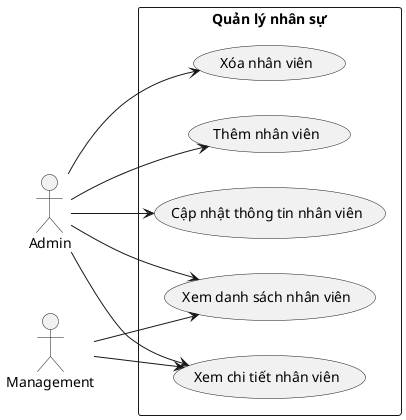
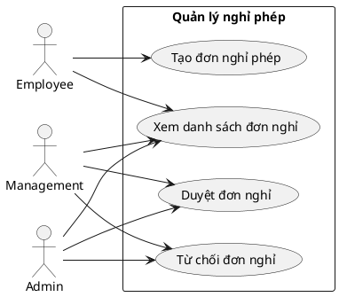
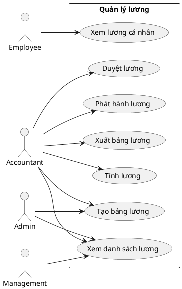
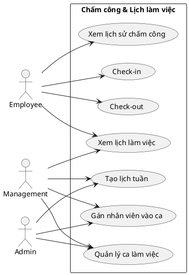
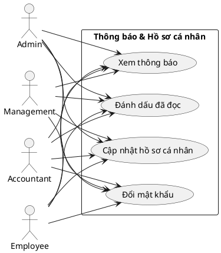
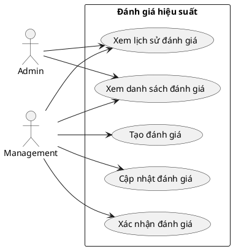

# Biểu đồ use case phân rã - StaffHub

Các biểu đồ dưới đây bám theo đúng tên các use case mức cao trong biểu đồ tổng quan. Mỗi khối có thể copy riêng để dán vào PlantUML.

## 1. Quản lý nhân sự

Phần này mô tả các chức năng chính liên quan đến hồ sơ nhân viên trong hệ thống. Admin có thể xem, thêm, sửa, xóa và theo dõi chi tiết thông tin nhân viên, trong khi Management chỉ được xem danh sách và chi tiết nhân viên thuộc phạm vi quản lý.

## 2. Quản lý nghỉ phép

Phần này thể hiện quy trình xử lý đơn nghỉ phép của nhân viên. Employee tạo và xem đơn của mình, còn Admin và Management có thể xem danh sách đơn, duyệt hoặc từ chối đơn nghỉ theo quyền hạn được phân công.

## 3. Quản lý lương

Phần này mô tả các thao tác liên quan đến tiền lương. Employee chỉ xem lương cá nhân, Management xem lương theo phòng ban, còn Accountant chịu trách nhiệm tạo bảng lương, tính lương, duyệt lương, phát hành lương và xuất dữ liệu lương.

## 4. Chấm công & Lịch làm việc

Phần này bao gồm các chức năng chấm công và phân ca làm việc. Employee thực hiện check-in, check-out và xem lịch làm việc; Management và Admin có thể tạo lịch tuần, gán nhân viên vào ca và quản lý ca làm việc.

## 5. Thông báo & Hồ sơ cá nhân

Phần này tập trung vào các chức năng cá nhân mà mọi vai trò đều cần sử dụng. Người dùng có thể xem thông báo, đánh dấu đã đọc, cập nhật thông tin cá nhân và đổi mật khẩu để tự quản lý tài khoản của mình.

## 6. Đánh giá hiệu suất

Phần này mô tả quy trình đánh giá kết quả làm việc của nhân viên. Management có thể tạo, cập nhật, xác nhận và xem lịch sử đánh giá, còn Admin chủ yếu xem tổng quan và theo dõi thông tin đánh giá.

